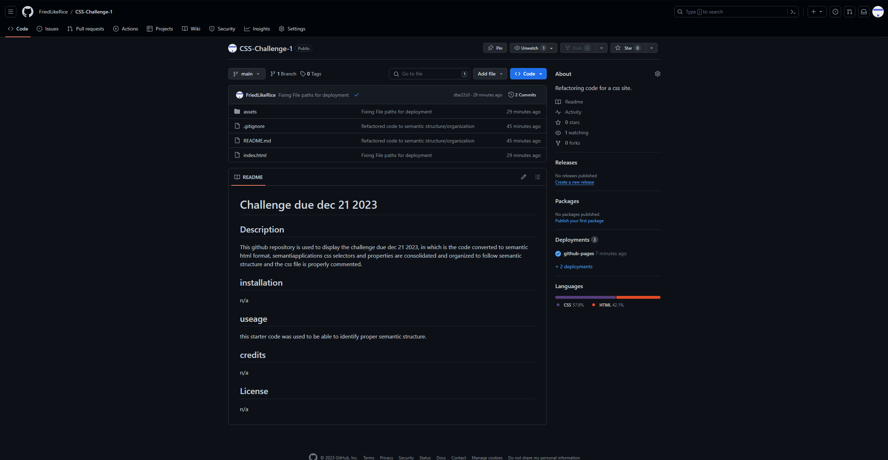

# Challenge due dec 21 2023

## Description
This github repository is used to display the challenge due dec 21 2023, in which is the code is refactored to semantic html format, and css selectors and properties are consolidated and organized to follow semantic structure and the css file is properly commented.

## installation
n/a

## useage
this starter code was used to be able to identify proper semantic structure.

## screenshot

## Links
GitHub Repo: https://github.com/FriedLikeRice/CSS-Challenge-1
Published site Link: https://friedlikerice.github.io/CSS-Challenge-1/